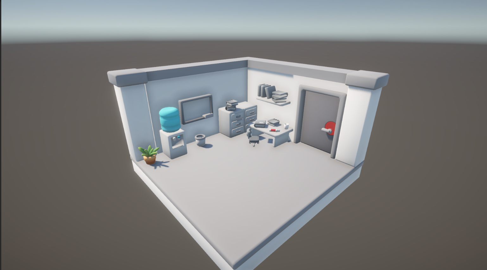
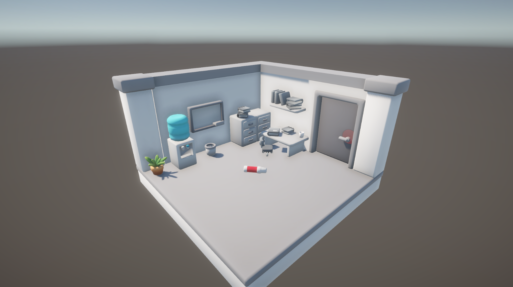
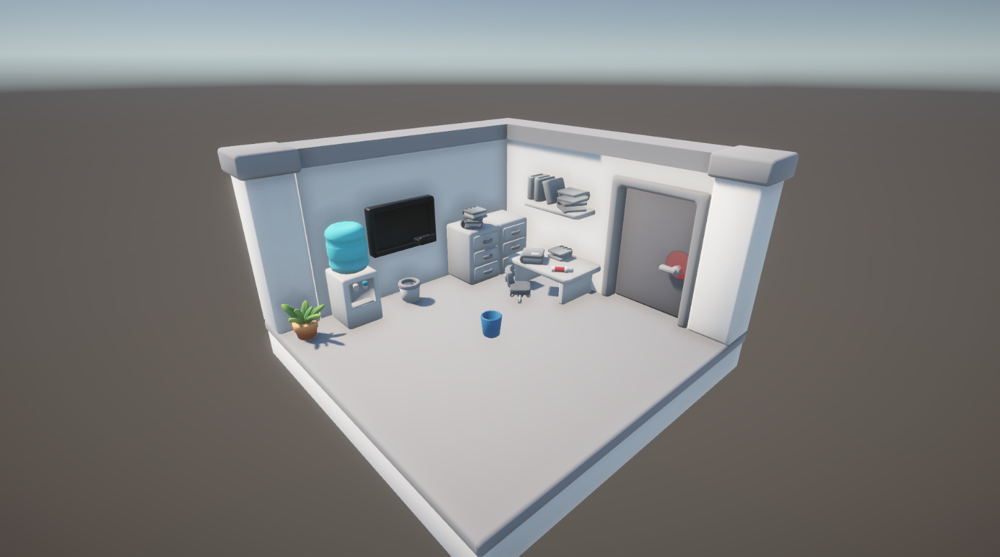
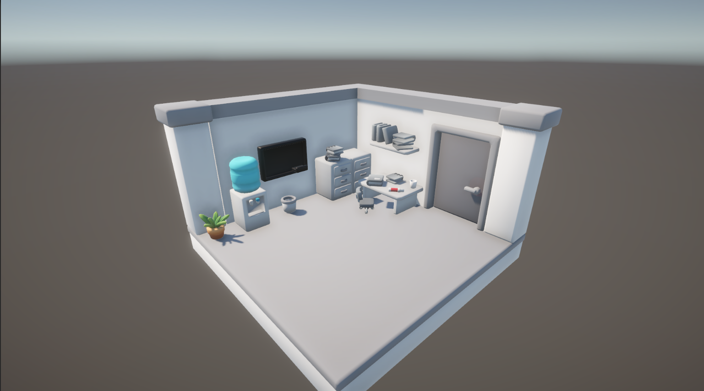

# Unity Mini Game



**Office Puzzle** is a short and fun Unity game that challenges the player to complete a series of interactive steps using everyday office items. The gameplay is designed to be both satisfying and intuitive, while the code follows clean architecture principles like **polymorphism** and the **singleton** pattern.

---

## Gameplay

To complete the level, the player must perform the following steps in order:

1. **Draw on the whiteboard**  
   - Click the pen, then click on the whiteboard.  
   - The board will turn black.  
   

2. **Fill the glass with water**  
   - Click and hold the glass, move it to the water dispenser.  
   - Then click on the dispenser to fill it. The glass turns blue.  
   

3. **Water the plant**  
   - Use the filled glass to water the plant. A water effect will play.

4. **Throw the glass into the bin**  
   - Drag the glass and release it into the trash bin.

5. **Finish the level**  
   - A blinking circle will appear on the door handle. Click it to end the level.  
   

---

## Technical Details

- **Unity Version**: 2021.3.45f1 (LTS)
- **Programming Language**: C#
- **Input System**: Classic Input (using `Input.GetMouseButtonDown`)
- **Render Pipeline**: Built-in

---

## Design Patterns Used

### Polymorphism

All interactive objects inherit from a common base class and implement a shared interface:

```csharp
public interface IInteractable
{
    void OnInteract();
}

public abstract class InteractableObject : MonoBehaviour, IInteractable
{
    public abstract void OnInteract();
}
```

This structure allows you to easily define custom interaction logic for objects like `Pen`, `Glass`, `Board`, `Flower`, etc., while keeping the code clean and scalable.

### Singleton

Game state and progression are managed through a Singleton `GameManage` class:

```csharp
public static GameManage Instance;

private void Awake()
{
    if (Instance != null && Instance != this)
    {
        Destroy(gameObject);
        return;
    }
    Instance = this;
    DontDestroyOnLoad(gameObject);
}
```

This ensures centralized control over gameplay steps, held objects, and finish logic.

---

## Getting Started

1. Download and install **Unity 2021.3.45f1 (LTS)**.
2. In the **Project window**, navigate to:  
   `Assets/Scenes/SampleScene.unity`
3. Double-click `SampleScene` to open it.

---


